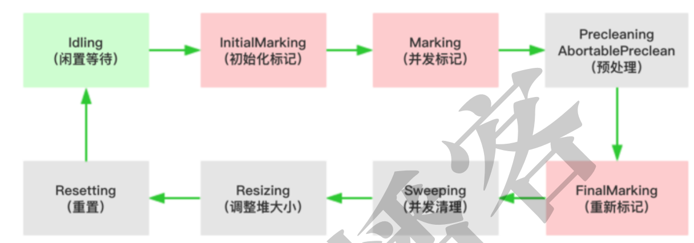
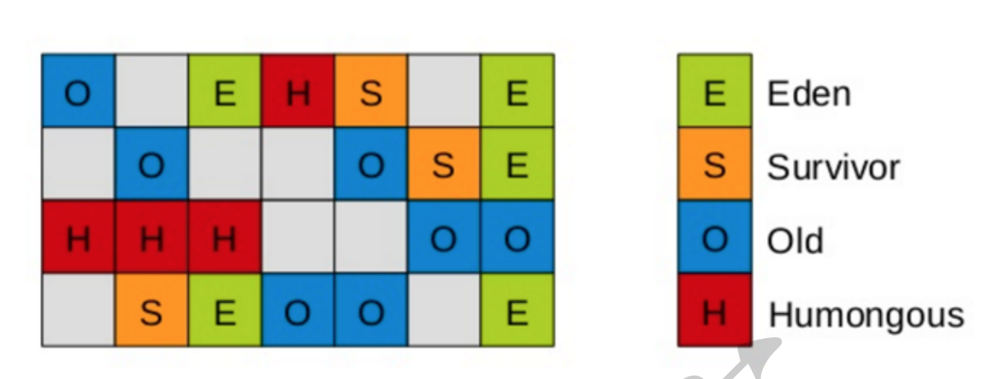
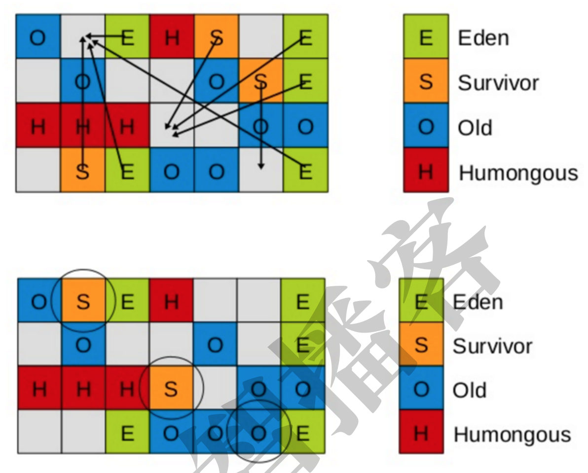

## JVM内存及监控
### 运行参数分类
* 标准参数(使用java -help查看所有标准参数)
    * -version
    * -help
```java   
#编译
[root@node01 test]# javac TestJVM.java
#测试
[root@node01 test]# java TestJVM
itcast
[root@node01 test]# java ‐Dstr=123 TestJVM
123
```
* -X参数（非标准参数，使用java -x查看所有非标准参数）
    * -Xint
        * 在解释模式(interpreted mode)下，-Xint标记会强制JVM执行所有的字节码，当然这会降低运行速度，通常低10倍或更多
    * -Xcomp
        * -Xcomp参数与它（-Xint）正好相反，JVM在第一次使用时会把所有的字节码编译成本地代码，从而带来最大程度的优化。
            * 然而，很多应用在使用-Xcomp也会有一些性能损失，当然这比使用-Xint损失的少，原因是-xcomp没有让JVM启用JIT编译器的全部功能。JIT编译器可以对是否需要编译做判断，如果所有代码都进行编译的话，对于一些只执行一次的代码就没有意义了
    * -Xmixed
        * 是混合模式，将解释模式与编译模式进行混合使用，由jvm自己决定，这是jvm默认的模式，也是推荐使用的模式    
```jshelllanguage
#强制设置为解释模式
[root@node01 test]# java ‐showversion ‐Xint TestJVM
java version "1.8.0_141"
Java(TM) SE Runtime Environment (build 1.8.0_141‐b15)
Java HotSpot(TM) 64‐Bit Server VM (build 25.141‐b15, interpreted mode)
itcast
#强制设置为编译模式
[root@node01 test]# java ‐showversion ‐Xcomp TestJVM
java version "1.8.0_141"
Java(TM) SE Runtime Environment (build 1.8.0_141‐b15)
Java HotSpot(TM) 64‐Bit Server VM (build 25.141‐b15, compiled mode)
itcast
#注意：编译模式下，第一次执行会比解释模式下执行慢一些，注意观察。
#默认的混合模式
[root@node01 test]# java ‐showversion TestJVM
java version "1.8.0_141"
Java(TM) SE Runtime Environment (build 1.8.0_141‐b15)
Java HotSpot(TM) 64‐Bit Server VM (build 25.141‐b15, mixed mode)
itcast
```
* -XX参数（使用率高的非标准参数）
    * -XX参数也是非标准参数，主要用于jvm的调优和debug操作。
    * -XX参数的使用有2种方式，一种是boolean类型，一种是非boolean类型：
        * boolean类型
            * 格式：-XX:[+-]
            * 如：-XX:+DisableExplicitGC 表示禁用手动调用gc操作，也就是说调用System.gc()无效
        * 非boolean类型
            * 格式：-XX:
            * 如：-XX:NewRatio=1 表示新生代和老年代的比值
```jshelllanguage
[root@node01 test]# java ‐showversion ‐XX:+DisableExplicitGC TestJVM
java version "1.8.0_141"
Java(TM) SE Runtime Environment (build 1.8.0_141‐b15)
Java HotSpot(TM) 64‐Bit Server VM (build 25.141‐b15, mixed mode)
itcast
``` 
* -Xms与-Xmx参数
    * -Xms与-Xmx分别是设置jvm的堆内存的初始大小和最大大小。
        * -Xmx2048m：等价于-XX:MaxHeapSize，设置JVM最大堆内存为2048M。
        * -Xms512m：等价于-XX:InitialHeapSize，设置JVM初始堆内存为512M。
        * 适当的调整jvm的内存大小，可以充分利用服务器资源，让程序跑的更快。
```jshelllanguage
[root@node01 test]# java ‐Xms512m ‐Xmx2048m TestJVM
itcast
```
### 查看JVM运行参数
#### 运行java命令时候打印参数
* 运行java命令时打印参数，需要添加-XX:+PrintFlagsFinal参数即可
    * eg:[root@node01 test]# java ‐XX:+PrintFlagsFinal ‐version
#### 查看正在运行的java进程的参数
* 如果想要查看正在运行的jvm就需要借助于jinfo命令查看。
```jshelllanguage
[root@node01 bin]# jinfo ‐flags 6219
Attaching to process ID 6219, please wait...
Debugger attached successfully.
Server compiler detected.
JVM version is 25.141‐b15
Non‐default VM flags: ‐XX:CICompilerCount=2 ‐XX:InitialHeapSize=31457280
‐XX:MaxHeapSize=488636416 ‐XX:MaxNewSize=162529280 ‐
XX:MinHeapDeltaBytes=524288 ‐XX:NewSize=10485760 ‐XX:OldSize=20971520 ‐
XX:+UseCompressedClassPointers ‐XX:+UseCompressedOops ‐
XX:+UseFastUnorderedTimeStamps ‐XX:+UseParallelGC
Command line: ‐Djava.util.logging.config.file=/tmp/apache‐tomcat‐
7.0.57/conf/logging.properties ‐
Djava.util.logging.manager=org.apache.juli.ClassLoaderLogManager ‐
Djava.endorsed.dirs=/tmp/apache‐tomcat‐7.0.57/endorsed ‐
Dcatalina.base=/tmp/apache‐tomcat‐7.0.57 ‐Dcatalina.home=/tmp/apache‐
tomcat‐7.0.57 ‐Djava.io.tmpdir=/tmp/apache‐tomcat‐7.0.57/temp
#查看某一参数的值，用法：jinfo ‐flag <参数名> <进程id>
[root@node01 bin]# jinfo ‐flag MaxHeapSize 6219
‐XX:MaxHeapSize=488636416
```
### JVM的内存模型
#### jdk1.7的堆内存模型

* Young年轻代
    * 年轻代划分为三部分，Eden区和俩个严格相同的Survivor区
    * Survivor区某一时刻其中一个被使用，另一个留做垃圾收集时复制对象
    * Eden区变满后，GC将存活的对象移动到空闲的survivor区间，根据JVM的策略，在经过几次垃圾收集后，任然存活于Survivor的对象将被移动到Tenured区间
* Tenured年老代
    * Tenured区主要保存生命周期长的对象，一般是一些老的对象，当一些对象在Young复制转移一定的次数以后，对象就会被转移到Tenured区，一般如果系统中用了application级别的缓存，缓存中的对象往往会被转移到这一区间
* Perm永久代
    * Perm代主要保存class,method,filed对象，这部份的空间一般不会溢出，除非一次性加载了很多的类，不过在涉及到热部署的应用服务器的时候，有时候会遇到java.lang.OutOfMemoryError : PermGen space 的错误，造成这个错误的很大原因就有可能是每次都重新部署，但是重新部署后，类的class没有被卸载掉，这样就造成了大量的class对象保存在了perm中，这种情况下，一般重新启动应用服务器可以解决问题。
* Virtual区：
    * 最大内存和初始内存的差值，就是Virtual区。
#### jdk1.8的堆内存模型

* jdk1.8的内存模型是由2部分组成，年轻代 + 年老代。
    * 年轻代：Eden + 2*Survivor
    * 年老代：OldGen
* 在jdk1.8中变化最大的Perm区，用Metaspace（元数据空间）进行了替换。需要特别说明的是：Metaspace所占用的内存空间不是在虚拟机内部，而是在本地内存空间中，这也是与1.7的永久代最大的区别所

#### 为什么要废弃1.7中的永久区？
官网给出了解释：http://openjdk.java.net/jeps/122    
>This is part of the JRockit and Hotspot convergence effort. JRockit
customers do not need to configure the permanent generation (since JRockit
does not have a permanent generation) and are accustomed to not
configuring the permanent generation.
移除永久代是为融合HotSpot JVM与 JRockit VM而做出的努力，因为JRockit没有永久代，
不需要配置永久代
* 现实使用中，由于永久代内存经常不够用或发生内存泄露，爆出异常java.lang.OutOfMemoryError: PermGen。基于此，将永久区废弃，而改用元空间，改为了使用本地内存空间。
#### 通过jstat命令进行查看堆内存使用情况
jstat命令可以查看堆内存各部分的使用量，以及加载类的数量。命令的格式如下：   
jstat [-命令选项] [vmid] [间隔时间/毫秒] [查询次数]   
* 查看class加载统计
```
[root@node01 ~]# jps
7080 Jps
6219 Bootstrap
[root@node01 ~]# jstat ‐class 6219
Loaded Bytes Unloaded Bytes Time
3273 7122.3 0 0.0 3.98

说明：
Loaded：加载class的数量
Bytes：所占用空间大小
Unloaded：未加载数量
Bytes：未加载占用空间
Time：时间
```
* 查看编译统计
```
anjiedeMBP:Desktop anjie$ jstat -compiler 13408
Compiled Failed Invalid   Time   FailedType FailedMethod
    2008      1       0     4.83          1 org/apache/tomcat/util/IntrospectionUtils setProperty
Compiled：编译数量。
Failed：失败数量
Invalid：不可用数量
Time：时间
FailedType：失败类型
FailedMethod：失败的方法
```
* 垃圾回收统计
```jshelllanguage
anjiedeMBP:Desktop anjie$ jstat -gc 13408
 S0C    S1C    S0U    S1U      EC       EU        OC         OU       MC     MU    CCSC   CCSU   YGC     YGCT    FGC    FGCT     GCT
5120.0 5120.0 5097.3  0.0   66560.0  29607.2   87552.0    16380.9   17664.0 17129.7 2048.0 1881.9      4    0.062   0      0.000    0.062
--也可以指定打印的间隔和次数，每1秒中打印一次，共打印5次--
 jstat ‐gc 13408 1000 5
 
 说明：
 S0C：第一个Survivor区的大小（KB）
 S1C：第二个Survivor区的大小（KB）
 S0U：第一个Survivor区的使用大小（KB）
 S1U：第二个Survivor区的使用大小（KB）
 EC：Eden区的大小（KB）
 EU：Eden区的使用大小（KB）
 OC：Old区大小（KB）
 OU：Old使用大小（KB）
 MC：方法区大小（KB）
 MU：方法区使用大小（KB）
 CCSC：压缩类空间大小（KB）
 CCSU：压缩类空间使用大小（KB）
 YGC：年轻代垃圾回收次数
 YGCT：年轻代垃圾回收消耗时间
 FGC：老年代垃圾回收次数
 FGCT：老年代垃圾回收消耗时间
 GCT：垃圾回收消耗总时间
```
#### jmap使用+内存溢出分析
* 前面通过jstat可以对jvm堆的内存进行统计分析，而jmap可以获取到更加详细的内容，如：内存使用情况的汇总、对内存溢出的定位与分析。
* 查看内存使用情况
    * jmap -heap 6219
* 查看内存中对象的数量和大小
    * 查看所有对象，包括活跃以及非活跃的
    * jmap ‐histo <pid> | more
    * 查看活跃对象
    * jmap ‐histo:live <pid> | more
* 将内存使用情况dump到文件中
    * 用法：
    * jmap ‐dump:format=b,file=dumpFileName <pid>
    * 示例
    * jmap ‐dump:format=b,file=/tmp/dump.dat 6219
* 通过jhat对dump文件进行分析
```jshelllanguage
#用法：
jhat ‐port <port> <file>
#示例：
[root@node01 tmp]# jhat ‐port 9999 /tmp/dump.dat
Reading from /tmp/dump.dat...
Dump file created Mon Sep 10 01:04:21 CST 2018
Snapshot read, resolving...
Resolving 204094 objects...
Chasing references, expect 40
dots........................................
Eliminating duplicate references........................................
Snapshot resolved.
Started HTTP server on port 9999
Server is ready.

打开浏览器进行访问：http://192.168.40.133:9999/
```
* 通过MAT工具对dump文件进行分析
    * MAT工具介绍    
MAT(Memory Analyzer Tool)，一个基于Eclipse的内存分析工具，是一个快速、功能丰富的JAVA heap分析工具，它可以帮助我们查找内存泄漏和减少内存消耗。使用内存分析工具从众多的对象中进行分析，快速的计算出在内存中对象的占用大小，看看是谁阻止了垃圾收集器的回收工作，并可以通过报表直观的查看到可能造成这种结果的对象。官网地址：https://www.eclipse.org/mat    
* 内存溢出对模拟
```jshelllanguage
package cn.itcast.jvm;
import java.util.ArrayList;
import java.util.List;
import java.util.UUID;
public class TestJvmOutOfMemory {
public static void main(String[] args) {
List<Object> list = new ArrayList<>();
for (int i = 0; i < 10000000; i++) {
String str = "";
for (int j = 0; j < 1000; j++) {
str += UUID.randomUUID().toString();
}
list.add(str);
}
System.out.println("ok");
}
}

#参数如下：
‐Xms8m ‐Xmx8m ‐XX:+HeapDumpOnOutOfMemoryError
```
#### jstack对使用
* 线程的状态

* 在Java中线程的状态一共被分成6种：
* 初始态（NEW）   
创建一个Thread对象，但还未调用start()启动线程时，线程处于初始态。
运行态（RUNNABLE），在Java中，运行态包括 就绪态 和 运行态。
就绪态
该状态下的线程已经获得执行所需的所有资源，只要CPU分配执行权就能运
行。
所有就绪态的线程存放在就绪队列中。
* 运行态   
获得CPU执行权，正在执行的线程。
由于一个CPU同一时刻只能执行一条线程，因此每个CPU每个时刻只有一条
运行态的线程。
* 阻塞态（BLOCKED）   
当一条正在执行的线程请求某一资源失败时，就会进入阻塞态。
而在Java中，阻塞态专指请求锁失败时进入的状态。
由一个阻塞队列存放所有阻塞态的线程。
处于阻塞态的线程会不断请求资源，一旦请求成功，就会进入就绪队列，等待执
行。
* 等待态（WAITING）   
当前线程中调用wait、join、park函数时，当前线程就会进入等待态。
也有一个等待队列存放所有等待态的线程。
线程处于等待态表示它需要等待其他线程的指示才能继续运行。
进入等待态的线程会释放CPU执行权，并释放资源（如：锁）
* 超时等待态（TIMED_WAITING）   
当运行中的线程调用sleep(time)、wait、join、parkNanos、parkUntil时，就
会进入该状态；
它和等待态一样，并不是因为请求不到资源，而是主动进入，并且进入后需要其
他线程唤醒；
进入该状态后释放CPU执行权 和 占有的资源。
与等待态的区别：到了超时时间后自动进入阻塞队列，开始竞争锁。
* 终止态（TERMINATED）   
线程执行结束后的状态
```jshelllanguage
public class TestDeadLock {
private static Object obj1 = new Object();
private static Object obj2 = new Object();
public static void main(String[] args) {
new Thread(new Thread1()).start();
new Thread(new Thread2()).start();
}
private static class Thread1 implements Runnable{
@Override
public void run() {
synchronized (obj1){
System.out.println("Thread1 拿到了 obj1 的锁！");
try {
// 停顿2秒的意义在于，让Thread2线程拿到obj2的锁
Thread.sleep(2000);
} catch (InterruptedException e) {
e.printStackTrace();
}
synchronized (obj2){
System.out.println("Thread1 拿到了 obj2 的锁！");
}
}
}
}
private static class Thread2 implements Runnable{
@Override
public void run() {
synchronized (obj2){
System.out.println("Thread2 拿到了 obj2 的锁！");
try {
// 停顿2秒的意义在于，让Thread1线程拿到obj1的锁
Thread.sleep(2000);
} catch (InterruptedException e) {
e.printStackTrace();
}
synchronized (obj1){
System.out.println("Thread2 拿到了 obj1 的锁！");
}
}
}
}
}

# 在linux上运行
[root@node01 test]# javac TestDeadLock.java
[root@node01 test]# ll
总用量 28
‐rw‐r‐‐r‐‐. 1 root root 184 9月 11 10:39 TestDeadLock$1.class
‐rw‐r‐‐r‐‐. 1 root root 843 9月 11 10:39 TestDeadLock.class
‐rw‐r‐‐r‐‐. 1 root root 1567 9月 11 10:39 TestDeadLock.java
‐rw‐r‐‐r‐‐. 1 root root 1078 9月 11 10:39 TestDeadLock$Thread1.class
‐rw‐r‐‐r‐‐. 1 root root 1078 9月 11 10:39 TestDeadLock$Thread2.class
‐rw‐r‐‐r‐‐. 1 root root 573 9月 9 10:21 TestJVM.class
‐rw‐r‐‐r‐‐. 1 root root 261 9月 9 10:21 TestJVM.java
[root@node01 test]# java TestDeadLock
Thread1 拿到了 obj1 的锁！
Thread2 拿到了 obj2 的锁！
#这里发生了死锁，程序一直将等待下去


# 使用jstack进行分析
"Thread‐1":
at TestDeadLock$Thread2.run(TestDeadLock.java:47)
‐ waiting to lock <0x00000000f655dc40> (a java.lang.Object)
‐ locked <0x00000000f655dc50> (a java.lang.Object)
at java.lang.Thread.run(Thread.java:748)
"Thread‐0":
at TestDeadLock$Thread1.run(TestDeadLock.java:27)
‐ waiting to lock <0x00000000f655dc50> (a java.lang.Object)
‐ locked <0x00000000f655dc40> (a java.lang.Object)
at java.lang.Thread.run(Thread.java:748)

可以清晰的看到：
Thread2获取了 <0x00000000f655dc50> 的锁，等待获取 <0x00000000f655dc40>
这个锁
Thread1获取了 <0x00000000f655dc40> 的锁，等待获取 <0x00000000f655dc50>
这个锁
由此可见，发生了死锁。
```
#### VisualVM工具的使用
>VisualVM，能够监控线程，内存情况，查看方法的CPU时间和内存中的对 象，已被GC的对象，反向查看分配的堆栈(如100个String对象分别由哪几个对象分配出来的)。
* 启动
在jdk的安装目录的bin目录下，找到jvisualvm.exe，双击打开即可。
* 查看本地进程
* 查看CPU、内存、类、线程运行信息
* 查看线程详情
* 抽样器
    * 抽样器可以对CPU、内存在一段时间内进行抽样，以供分析。
* 监控远程的jvm
VisualJVM不仅是可以监控本地jvm进程，还可以监控远程的jvm进程，需要借助于JMX技
术实现。
    * 什么是JMX？
        * JMX（Java Management Extensions，即Java管理扩展）是一个为应用程序、设备、系统等植入管理功能的框架。JMX可以跨越一系列异构操作系统平台、系统体系结构和网络传输协议，灵活的开发无缝集成的系统、网络和服务管理应用。
    * 监控远程的tomcat
```jshelllanguage
#在tomcat的bin目录下，修改catalina.sh，添加如下的参数
JAVA_OPTS="‐Dcom.sun.management.jmxremote ‐
Dcom.sun.management.jmxremote.port=9999 ‐
Dcom.sun.management.jmxremote.authenticate=false ‐
Dcom.sun.management.jmxremote.ssl=false"
#这几个参数的意思是：
#‐Dcom.sun.management.jmxremote ：允许使用JMX远程管理
#‐Dcom.sun.management.jmxremote.port=9999 ：JMX远程连接端口
#‐Dcom.sun.management.jmxremote.authenticate=false ：不进行身份认证，任何用
户都可以连接
#‐Dcom.sun.management.jmxremote.ssl=false ：不使用ssl
```

## JVM垃圾回收
### 什么是垃圾回收
程序的运行必然需要申请内存资源，无效的对象资源如果不及时处理就会一直占有内存
资源，最终将导致内存溢出，所以对内存资源的管理是非常重要了
#### C/C++语言的垃圾回收
在C/C++语言中，没有自动垃圾回收机制，是通过new关键字申请内存资源，通过delete
关键字释放内存资源。
如果，程序员在某些位置没有写delete进行释放，那么申请的对象将一直占用内存资源，
最终可能会导致内存溢出
#### Java语言的垃圾回收
为了让程序员更专注于代码的实现，而不用过多的考虑内存释放的问题，所以，在Java语
言中，有了自动的垃圾回收机制，也就是我们熟悉的GC。    
有了垃圾回收机制后，程序员只需要关心内存的申请即可，内存的释放由系统自动识别
完成。    
换句话说，自动的垃圾回收的算法就会变得非常重要了，如果因为算法的不合理，导致
内存资源一直没有释放，同样也可能会导致内存溢出的。    
当然，除了Java语言，C#、Python等语言也都有自动的垃圾回收机制。   
### 垃圾回收的常见算法
常见的垃圾回收算法有：引用计数法、标记清除法、标记压缩法、复制算法、分代算法等。
* 引用计数法
    * 引用计数是历史最悠久的一种算法，最早George E. Collins在1960的时候首次提出，50年后的今天，该算法依然被很多编程语言使用
    * 原理：假设有一个对象A，任何一个对象对A的引用，那么对象A的引用计数器+1，当引用失败
      时，对象A的引用计数器就-1，如果对象A的计数器的值为0，就说明对象A没有引用了，
      可以被回收
    * 优点
        * 实时性较高，无需等到内存不够的时候，才开始回收，运行时根据对象的计数器是否为0，就可以直接回收。
        * 在垃圾回收过程中，应用无需挂起。如果申请内存时，内存不足，则立刻报outofmember 错误。
        * 区域性，更新对象的计数器时，只是影响到该对象，不会扫描全部对象
    * 缺点
        * 每次对象被引用时，都需要去更新计数器，有一点时间开销。
        * 浪费CPU资源，即使内存够用，仍然在运行时进行计数器的统计。
        * 无法解决循环引用问题。（最大的缺点）
* 标记清除法
    * 标记清除算法，是将垃圾回收分为2个阶段，分别是标记和清除。标记：从根节点开始标记引用的对象。清除：未被标记引用的对象就是垃圾对象，可以被清理    
    * 优点：可以看到，标记清除算法解决了引用计数算法中的循环引用的问题，没有从root节点引用的对象都会被回收
    * 缺点：
        * 效率较低，标记和清除两个动作都需要遍历所有的对象，并且在GC时，需要停止应
        用程序，对于交互性要求比较高的应用而言这个体验是非常差的。
        * 通过标记清除算法清理出来的内存，碎片化较为严重，因为被回收的对象可能存在于
        内存的各个角落，所以清理出来的内存是不连贯的。
* 标记压缩算法
    * 标记压缩算法是在标记清除算法的基础之上，做了优化改进的算法。和标记清除算法一
      样，也是从根节点开始，对对象的引用进行标记，在清理阶段，并不是简单的清理未标
      记的对象，而是将存活的对象压缩到内存的一端，然后清理边界以外的垃圾，从而解决
      了碎片化的问题。
    * 优缺点同标记清除算法，解决了标记清除算法的碎片化的问题，同时，标记压缩算法多了一步，对象移动内存位置的步骤，其效率也有有一定的影响。
* 复制算法
    * 复制算法的核心就是，将原有的内存空间一分为二，每次只用其中的一块，在垃圾回收
      时，将正在使用的对象复制到另一个内存空间中，然后将该内存空间清空，交换两个内
      存的角色，完成垃圾的回收
    * 如果内存中的垃圾对象较多，需要复制的对象就较少，这种情况下适合使用该方式并且
      效率比较高，反之，则不适合
    * JVM中年轻代内存空间
        * 1、在GC开始的时候，对象只会存在于Eden区和名为“From”的Survivor区，Survivor
          区“To”是空的
        * 2、紧接着进行GC，Eden区中所有存活的对象都会被复制到“To”，而在“From”区中，仍
          存活的对象会根据他们的年龄值来决定去向。年龄达到一定值(年龄阈值，可以通过XX:MaxTenuringThreshold来设置)的对象会被移动到年老代中，没有达到阈值的对
          象会被复制到“To”区域
        * 3、 经过这次GC后，Eden区和From区已经被清空。这个时候，“From”和“To”会交换他
        们的角色，也就是新的“To”就是上次GC前的“From”，新的“From”就是上次GC前
        的“To”。不管怎样，都会保证名为To的Survivor区域是空的。
        * 4、GC会一直重复这样的过程，直到“To”区被填满，“To”区被填满之后，会将所有对象
        移动到年老代中
    * 优点：
      在垃圾对象多的情况下，效率较高   
      清理后，内存无碎片   
    * 缺点
      在垃圾对象少的情况下，不适用，如：老年代内存   
      分配的2块内存空间，在同一个时刻，只能使用一半，内存使用率较低   
* 分代算法
分代算法其实就是这样的，根据回收对象的特点进行选择，在jvm中，年轻代适合使用复
制算法，老年代适合使用标记清除或标记压缩算法。
### 垃圾收集器以及内存分配
在jvm中，实现了多种垃圾收集器，包括：串行垃圾收集器、并行垃圾收集器、CMS（并发）垃圾收集器、G1垃圾收集器。。。
#### 串行垃圾收集器
是指使用单线程进行垃圾回收，垃圾回收时，只有一个线程在工作，
并且java应用中的所有线程都要暂停，等待垃圾回收的完成。这种现象称之为
STW（Stop-The-World）。
对于交互性较强的应用而言，这种垃圾收集器是不能够接受的。
一般在Javaweb应用中是不会采用该收集器的。
* 设置垃圾回收为串行收集器
    * -XX:+UseSerialGC
    指定年轻代和老年代都使用串行垃圾收集器
    * -XX:+PrintGCDetails
    打印垃圾回收的详细信息
    ```
    # 为了测试GC，将堆的初始和最大内存都设置为16M
    -XX:+UseSerialGC -XX:+PrintGCDetails -Xms16m -Xmx16m
    
    [GC (Allocation Failure) [DefNew: 4416K‐>512K(4928K), 0.0046102 secs]
    4416K‐>1973K(15872K), 0.0046533 secs] [Times: user=0.00 sys=0.00,
    real=0.00 secs]
    [Full GC (Allocation Failure) [Tenured: 10944K‐>3107K(10944K), 0.0085637
    secs] 15871K‐>3107K(15872K), [Metaspace: 3496K‐>3496K(1056768K)],
    0.0085974 secs] [Times: user=0.02 sys=0.00, real=0.01 secs]
    GC日志信息解读：
    年轻代的内存GC前后的大小：
    DefNew
    表示使用的是串行垃圾收集器。
    4416K->512K(4928K)
    表示，年轻代GC前，占有4416K内存，GC后，占有512K内存，总大小4928K
    0.0046102 secs
    表示，GC所用的时间，单位为毫秒。
    4416K->1973K(15872K)
    表示，GC前，堆内存占有4416K，GC后，占有1973K，总大小为15872K
    Full GC
    表示，内存空间全部进行GC
    ```
#### 并行垃圾收集器
并行垃圾收集器在串行垃圾收集器的基础之上做了改进，将单线程改为了多线程进行垃
圾回收，这样可以缩短垃圾回收的时间。（这里是指，并行能力较强的机器）   
当然了，并行垃圾收集器在收集的过程中也会暂停应用程序，这个和串行垃圾回收器是
一样的，只是并行执行，速度更快些，暂停的时间更短一些
* ParNew垃圾收集器
    * ParNew垃圾收集器是工作在年轻代上的，只是将串行的垃圾收集器改为了并行。
        * 通过-XX:+UseParNewGC参数设置年轻代使用ParNew回收器，老年代使用的依然是串行
          收集器
    ```
    #参数
    -XX:+UseParNewGC -XX:+PrintGCDetails -Xms16m -Xmx16m
    #打印出的信息
    [GC (Allocation Failure) [ParNew: 4416K‐>512K(4928K), 0.0032106 secs]
    4416K‐>1988K(15872K), 0.0032697 secs] [Times: user=0.00 sys=0.00,
    real=0.00 secs]
    由以上信息可以看出， ParNew: 使用的是ParNew收集器。其他信息和串行收集器一
    致。
    ```   
* ParallelGC垃圾收集器
    * ParallelGC收集器工作机制和ParNewGC收集器一样，只是在此基础之上，新增了两个和
      系统吞吐量相关的参数，使得其使用起来更加的灵活和高效
    ```
    相关参数如下：
    -XX:+UseParallelGC
    年轻代使用ParallelGC垃圾回收器，老年代使用串行回收器。
    -XX:+UseParallelOldGC
    年轻代使用ParallelGC垃圾回收器，老年代使用ParallelOldGC垃圾回收器。
    -XX:MaxGCPauseMillis
    设置最大的垃圾收集时的停顿时间，单位为毫秒
    需要注意的时，ParallelGC为了达到设置的停顿时间，可能会调整堆大小或其他
    的参数，如果堆的大小设置的较小，就会导致GC工作变得很频繁，反而可能会
    影响到性能。
    该参数使用需谨慎。
    -XX:GCTimeRatio
    设置垃圾回收时间占程序运行时间的百分比，公式为1/(1+n)。
    它的值为0~100之间的数字，默认值为99，也就是垃圾回收时间不能超过1%
    -XX:UseAdaptiveSizePolicy
    自适应GC模式，垃圾回收器将自动调整年轻代、老年代等参数，达到吞吐量、
    堆大小、停顿时间之间的平衡。
    一般用于，手动调整参数比较困难的场景，让收集器自动进行调整。
    
    
    #参数
    ‐XX:+UseParallelGC ‐XX:+UseParallelOldGC ‐XX:MaxGCPauseMillis=100 ‐
    XX:+PrintGCDetails ‐Xms16m ‐Xmx16m
    #打印的信息
    [GC (Allocation Failure) [PSYoungGen: 4096K‐>480K(4608K)] 4096K‐
    >1840K(15872K), 0.0034307 secs] [Times: user=0.00 sys=0.00, real=0.00
    secs]
    [Full GC (Ergonomics) [PSYoungGen: 505K‐>0K(4608K)] [ParOldGen: 10332K‐
    >10751K(11264K)] 10837K‐>10751K(15872K), [Metaspace: 3491K‐
    >3491K(1056768K)], 0.0793622 secs] [Times: user=0.13 sys=0.00, real=0.08
    secs]
    
    有以上信息可以看出，年轻代和老年代都使用了ParallelGC垃圾回收器。

    ```
#### CMS垃圾收集器
>CMS全称 Concurrent Mark Sweep，是一款并发的、使用标记-清除算法的垃圾回收器，
该回收器是针对老年代垃圾回收的，通过参数-XX:+UseConcMarkSweepGC进行设置

* CMS垃圾回收器的执行过程如下：

    * 初始化标记(CMS-initial-mark) ,标记root，会导致stw；
    * 并发标记(CMS-concurrent-mark)，与用户线程同时运行；
    * 预清理（CMS-concurrent-preclean），与用户线程同时运行；
    * 重新标记(CMS-remark) ，会导致stw；
    * 并发清除(CMS-concurrent-sweep)，与用户线程同时运行；
    * 调整堆大小，设置CMS在清理之后进行内存压缩，目的是清理内存中的碎片；
    * 并发重置状态等待下次CMS的触发(CMS-concurrent-reset)，与用户线程同时运行；
* 测试
```
#设置启动参数
‐XX:+UseConcMarkSweepGC ‐XX:+PrintGCDetails ‐Xms16m ‐Xmx16m
#运行日志
[GC (Allocation Failure) [ParNew: 4926K‐>512K(4928K), 0.0041843 secs]
9424K‐>6736K(15872K), 0.0042168 secs] [Times: user=0.00 sys=0.00,
real=0.00 secs]
#第一步，初始标记
[GC (CMS Initial Mark) [1 CMS‐initial‐mark: 6224K(10944K)] 6824K(15872K),
0.0004209 secs] [Times: user=0.00 sys=0.00, real=0.00 secs]
#第二步，并发标记
[CMS‐concurrent‐mark‐start]
[CMS‐concurrent‐mark: 0.002/0.002 secs] [Times: user=0.00 sys=0.00,
real=0.00 secs]
#第三步，预处理
[CMS‐concurrent‐preclean‐start]
[CMS‐concurrent‐preclean: 0.000/0.000 secs] [Times: user=0.00 sys=0.00,
real=0.00 secs]
#第四步，重新标记
[GC (CMS Final Remark) [YG occupancy: 1657 K (4928 K)][Rescan (parallel)
, 0.0005811 secs][weak refs processing, 0.0000136 secs][class unloading,
0.0003671 secs][scrub symbol table, 0.0006813 secs][scrub string table,
0.0001216 secs][1 CMS‐remark: 6224K(10944K)] 7881K(15872K), 0.0018324
secs] [Times: user=0.00 sys=0.00, real=0.00 secs]
#第五步，并发清理
[CMS‐concurrent‐sweep‐start]
[CMS‐concurrent‐sweep: 0.004/0.004 secs] [Times: user=0.00 sys=0.00,
real=0.00 secs]
#第六步，重置
[CMS‐concurrent‐reset‐start]
[CMS‐concurrent‐reset: 0.000/0.000 secs] [Times: user=0.00 sys=0.00,
real=0.00 secs]
```
#### G1垃圾收集器（重点）
* G1的设计原则就是简化JVM性能调优，开发人员只需要简单的三步即可完成调优：
    * 第一步，开启G1垃圾收集器
    * 第二步，设置堆的最大内存
    * 第三步，设置最大的停顿时间
    * G1中提供了三种模式垃圾回收模式，Young GC、Mixed GC 和 Full GC，在不同的条件
      下被触发。
* 原理
    * G1垃圾收集器相对比其他收集器而言，最大的区别在于它取消了年轻代、老年代的物理
      划分，取而代之的是将堆划分为若干个区域（Region），这些区域中包含了有逻辑上的
      年轻代、老年代区域。   
      这样做的好处就是，我们再也不用单独的空间对每个代进行设置了，不用担心每个代内
      存是否足够。
    
    
    * 在G1划分的区域中，年轻代的垃圾收集依然采用暂停所有应用线程的方式，将存活对象
      拷贝到老年代或者Survivor空间，G1收集器通过将对象从一个区域复制到另外一个区
      域，完成了清理工作。   
      这就意味着，在正常的处理过程中，G1完成了堆的压缩（至少是部分堆的压缩），这样
      也就不会有cms内存碎片问题的存在了
    * 在G1中，有一种特殊的区域，叫Humongous区域
        * 如果一个对象占用的空间超过了分区容量50%以上，G1收集器就认为这是一个巨型对象。
        * 这些巨型对象，默认直接会被分配在老年代，但是如果它是一个短期存在的巨型对象，就会对垃圾收集器造成负面影响。
        * 为了解决这个问题，G1划分了一个Humongous区，它用来专门存放巨型对象。如果
        一个H区装不下一个巨型对象，那么G1会寻找连续的H分区来存储。为了能找到连续
        的H区，有时候不得不启动Full GC。
* Young GC：Young GC主要是对Eden区进行GC，它在Eden空间耗尽时会被触发。
    * Eden空间的数据移动到Survivor空间中，如果Survivor空间不够，Eden空间的部分
    数据会直接晋升到年老代空间。
    * Survivor区的数据移动到新的Survivor区中，也有部分数据晋升到老年代空间中。
    * 最终Eden空间的数据为空，GC停止工作，应用线程继续执行。
    
    * Remembered Set（已记忆集合）
      在GC年轻代的对象时，我们如何找到年轻代中对象的根对象呢？
      根对象可能是在年轻代中，也可以在老年代中，那么老年代中的所有对象都是根么？
      如果全量扫描老年代，那么这样扫描下来会耗费大量的时间。
      于是，G1引进了RSet的概念。它的全称是Remembered Set，其作用是跟踪指向某个堆
      内的对象引用。
* Mixed GC
    * 当越来越多的对象晋升到老年代old region时，为了避免堆内存被耗尽，虚拟机会触发一
    个混合的垃圾收集器，即Mixed GC，该算法并不是一个Old GC，除了回收整个Young
    Region，还会回收一部分的Old Region，这里需要注意：是一部分老年代，而不是全部
    老年代，可以选择哪些old region进行收集，从而可以对垃圾回收的耗时时间进行控制。
    也要注意的是Mixed GC 并不是 Full GC。   
    MixedGC什么时候触发？ 由参数 -XX:Initiating HeapOccupancyPercent=n 决定。默
    认：45%，该参数的意思是：当老年代大小占整个堆大小百分比达到该阀值时触发。
    * 它的GC步骤分2步：
        * 全局并发标记（global concurrent marking）
        * 拷贝存活对象（evacuation）
        ```
        全局并发标记，执行过程分为五个步骤：
        初始标记（initial mark，STW）
        标记从根节点直接可达的对象，这个阶段会执行一次年轻代GC，会产生全局停
        顿。
        北京市昌平区建材城西路金燕龙办公楼一层 电话：400-618-9090 传智播客
        根区域扫描（root region scan）
        G1 GC 在初始标记的存活区扫描对老年代的引用，并标记被引用的对象。
        该阶段与应用程序（非 STW）同时运行，并且只有完成该阶段后，才能开始下
        一次 STW 年轻代垃圾回收。
        并发标记（Concurrent Marking）
        G1 GC 在整个堆中查找可访问的（存活的）对象。该阶段与应用程序同时运行，
        可以被 STW 年轻代垃圾回收中断。
        重新标记（Remark，STW）
        该阶段是 STW 回收，因为程序在运行，针对上一次的标记进行修正。
        清除垃圾（Cleanup，STW）
        清点和重置标记状态，该阶段会STW，这个阶段并不会实际上去做垃圾的收集，
        等待evacuation阶段来回收。
        
        拷贝存活对象
        Evacuation阶段是全暂停的。该阶段把一部分Region里的活对象拷贝到另一部分Region
        中，从而实现垃圾的回收清理
        ```
* G1收集器相关参数
```
-XX:+UseG1GC
使用 G1 垃圾收集器
-XX:MaxGCPauseMillis
设置期望达到的最大GC停顿时间指标（JVM会尽力实现，但不保证达到），默认
值是 200 毫秒。
-XX:G1HeapRegionSize=n
设置的 G1 区域的大小。值是 2 的幂，范围是 1 MB 到 32 MB 之间。目标是根
据最小的 Java 堆大小划分出约 2048 个区域。
默认是堆内存的1/2000。
-XX:ParallelGCThreads=n
设置 STW 工作线程数的值。将 n 的值设置为逻辑处理器的数量。n 的值与逻辑
处理器的数量相同，最多为 8。
-XX:ConcGCThreads=n
北京市昌平区建材城西路金燕龙办公楼一层 电话：400-618-9090 传智播客
设置并行标记的线程数。将 n 设置为并行垃圾回收线程数 (ParallelGCThreads)
的 1/4 左右。
-XX:InitiatingHeapOccupancyPercent=n
设置触发标记周期的 Java 堆占用率阈值。默认占用率是整个 Java 堆的 45%。

```
* 对于G1垃圾收集器优化建议
    * 年轻代大小
        * 避免使用 -Xmn 选项或 -XX:NewRatio 等其他相关选项显式设置年轻代大小。
        * 固定年轻代的大小会覆盖暂停时间目标。
    * 暂停时间目标不要太过严苛
        * G1 GC 的吞吐量目标是 90% 的应用程序时间和 10%的垃圾回收时间。
        * 评估 G1 GC 的吞吐量时，暂停时间目标不要太严苛。目标太过严苛表示您愿意
        承受更多的垃圾回收开销，而这会直接影响到吞吐量
### 可视化GC日志分析工具
* GC日志输出参数
```
在日志打印输出涉及到的参数如下：
    ‐XX:+PrintGC 输出GC日志
    ‐XX:+PrintGCDetails 输出GC的详细日志
    ‐XX:+PrintGCTimeStamps 输出GC的时间戳（以基准时间的形式）
    ‐XX:+PrintGCDateStamps 输出GC的时间戳（以日期的形式，如 2013‐05‐
    04T21:53:59.234+0800）
    ‐XX:+PrintHeapAtGC 在进行GC的前后打印出堆的信息
    ‐Xloggc:../logs/gc.log 日志文件的输出路径

```
测试：
```
‐XX:+UseG1GC ‐XX:MaxGCPauseMillis=100 ‐Xmx256m ‐XX:+PrintGCDetails ‐
XX:+PrintGCTimeStamps ‐XX:+PrintGCDateStamps ‐XX:+PrintHeapAtGC ‐
Xloggc:F://test//gc.log
```
* GC Easy 可视化工具
    * GC Easy是一款在线的可视化工具，易用、功能强大，网站：https://gceasy.io/
## JVM调优
