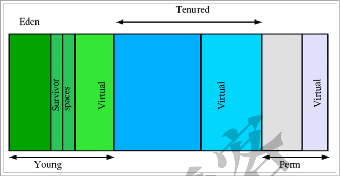
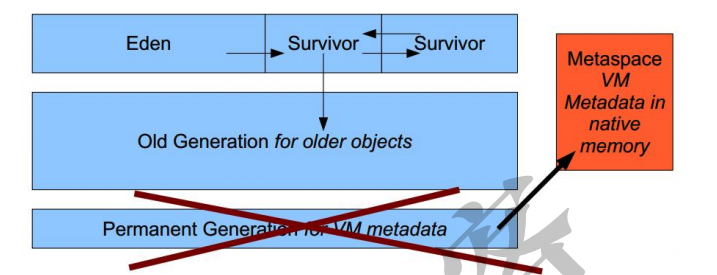
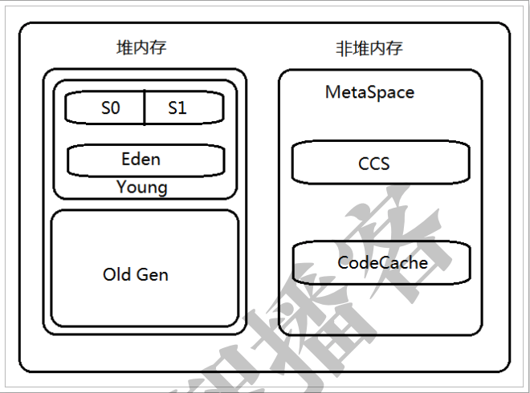
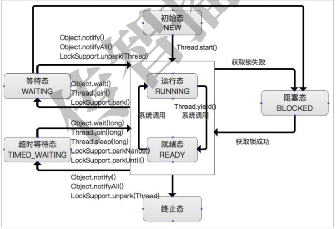

## JVM内存及监控
### 运行参数分类
* 标准参数(使用java -help查看所有标准参数)
    * -version
    * -help
```java   
#编译
[root@node01 test]# javac TestJVM.java
#测试
[root@node01 test]# java TestJVM
itcast
[root@node01 test]# java ‐Dstr=123 TestJVM
123
```
* -X参数（非标准参数，使用java -x查看所有非标准参数）
    * -Xint
        * 在解释模式(interpreted mode)下，-Xint标记会强制JVM执行所有的字节码，当然这会降低运行速度，通常低10倍或更多
    * -Xcomp
        * -Xcomp参数与它（-Xint）正好相反，JVM在第一次使用时会把所有的字节码编译成本地代码，从而带来最大程度的优化。
            * 然而，很多应用在使用-Xcomp也会有一些性能损失，当然这比使用-Xint损失的少，原因是-xcomp没有让JVM启用JIT编译器的全部功能。JIT编译器可以对是否需要编译做判断，如果所有代码都进行编译的话，对于一些只执行一次的代码就没有意义了
    * -Xmixed
        * 是混合模式，将解释模式与编译模式进行混合使用，由jvm自己决定，这是jvm默认的模式，也是推荐使用的模式    
```jshelllanguage
#强制设置为解释模式
[root@node01 test]# java ‐showversion ‐Xint TestJVM
java version "1.8.0_141"
Java(TM) SE Runtime Environment (build 1.8.0_141‐b15)
Java HotSpot(TM) 64‐Bit Server VM (build 25.141‐b15, interpreted mode)
itcast
#强制设置为编译模式
[root@node01 test]# java ‐showversion ‐Xcomp TestJVM
java version "1.8.0_141"
Java(TM) SE Runtime Environment (build 1.8.0_141‐b15)
Java HotSpot(TM) 64‐Bit Server VM (build 25.141‐b15, compiled mode)
itcast
#注意：编译模式下，第一次执行会比解释模式下执行慢一些，注意观察。
#默认的混合模式
[root@node01 test]# java ‐showversion TestJVM
java version "1.8.0_141"
Java(TM) SE Runtime Environment (build 1.8.0_141‐b15)
Java HotSpot(TM) 64‐Bit Server VM (build 25.141‐b15, mixed mode)
itcast
```
* -XX参数（使用率高的非标准参数）
    * -XX参数也是非标准参数，主要用于jvm的调优和debug操作。
    * -XX参数的使用有2种方式，一种是boolean类型，一种是非boolean类型：
        * boolean类型
            * 格式：-XX:[+-]
            * 如：-XX:+DisableExplicitGC 表示禁用手动调用gc操作，也就是说调用System.gc()无效
        * 非boolean类型
            * 格式：-XX:
            * 如：-XX:NewRatio=1 表示新生代和老年代的比值
```jshelllanguage
[root@node01 test]# java ‐showversion ‐XX:+DisableExplicitGC TestJVM
java version "1.8.0_141"
Java(TM) SE Runtime Environment (build 1.8.0_141‐b15)
Java HotSpot(TM) 64‐Bit Server VM (build 25.141‐b15, mixed mode)
itcast
``` 
* -Xms与-Xmx参数
    * -Xms与-Xmx分别是设置jvm的堆内存的初始大小和最大大小。
        * -Xmx2048m：等价于-XX:MaxHeapSize，设置JVM最大堆内存为2048M。
        * -Xms512m：等价于-XX:InitialHeapSize，设置JVM初始堆内存为512M。
        * 适当的调整jvm的内存大小，可以充分利用服务器资源，让程序跑的更快。
```jshelllanguage
[root@node01 test]# java ‐Xms512m ‐Xmx2048m TestJVM
itcast
```
### 查看JVM运行参数
#### 运行java命令时候打印参数
* 运行java命令时打印参数，需要添加-XX:+PrintFlagsFinal参数即可
    * eg:[root@node01 test]# java ‐XX:+PrintFlagsFinal ‐version
#### 查看正在运行的java进程的参数
* 如果想要查看正在运行的jvm就需要借助于jinfo命令查看。
```jshelllanguage
[root@node01 bin]# jinfo ‐flags 6219
Attaching to process ID 6219, please wait...
Debugger attached successfully.
Server compiler detected.
JVM version is 25.141‐b15
Non‐default VM flags: ‐XX:CICompilerCount=2 ‐XX:InitialHeapSize=31457280
‐XX:MaxHeapSize=488636416 ‐XX:MaxNewSize=162529280 ‐
XX:MinHeapDeltaBytes=524288 ‐XX:NewSize=10485760 ‐XX:OldSize=20971520 ‐
XX:+UseCompressedClassPointers ‐XX:+UseCompressedOops ‐
XX:+UseFastUnorderedTimeStamps ‐XX:+UseParallelGC
Command line: ‐Djava.util.logging.config.file=/tmp/apache‐tomcat‐
7.0.57/conf/logging.properties ‐
Djava.util.logging.manager=org.apache.juli.ClassLoaderLogManager ‐
Djava.endorsed.dirs=/tmp/apache‐tomcat‐7.0.57/endorsed ‐
Dcatalina.base=/tmp/apache‐tomcat‐7.0.57 ‐Dcatalina.home=/tmp/apache‐
tomcat‐7.0.57 ‐Djava.io.tmpdir=/tmp/apache‐tomcat‐7.0.57/temp
#查看某一参数的值，用法：jinfo ‐flag <参数名> <进程id>
[root@node01 bin]# jinfo ‐flag MaxHeapSize 6219
‐XX:MaxHeapSize=488636416
```
### JVM的内存模型
#### jdk1.7的堆内存模型

* Young年轻代
    * 年轻代划分为三部分，Eden区和俩个严格相同的Survivor区
    * Survivor区某一时刻其中一个被使用，另一个留做垃圾收集时复制对象
    * Eden区变满后，GC将存活的对象移动到空闲的survivor区间，根据JVM的策略，在经过几次垃圾收集后，任然存活于Survivor的对象将被移动到Tenured区间
* Tenured年老代
    * Tenured区主要保存生命周期长的对象，一般是一些老的对象，当一些对象在Young复制转移一定的次数以后，对象就会被转移到Tenured区，一般如果系统中用了application级别的缓存，缓存中的对象往往会被转移到这一区间
* Perm永久代
    * Perm代主要保存class,method,filed对象，这部份的空间一般不会溢出，除非一次性加载了很多的类，不过在涉及到热部署的应用服务器的时候，有时候会遇到java.lang.OutOfMemoryError : PermGen space 的错误，造成这个错误的很大原因就有可能是每次都重新部署，但是重新部署后，类的class没有被卸载掉，这样就造成了大量的class对象保存在了perm中，这种情况下，一般重新启动应用服务器可以解决问题。
* Virtual区：
    * 最大内存和初始内存的差值，就是Virtual区。
#### jdk1.8的堆内存模型

* jdk1.8的内存模型是由2部分组成，年轻代 + 年老代。
    * 年轻代：Eden + 2*Survivor
    * 年老代：OldGen
* 在jdk1.8中变化最大的Perm区，用Metaspace（元数据空间）进行了替换。需要特别说明的是：Metaspace所占用的内存空间不是在虚拟机内部，而是在本地内存空间中，这也是与1.7的永久代最大的区别所

#### 为什么要废弃1.7中的永久区？
官网给出了解释：http://openjdk.java.net/jeps/122    
>This is part of the JRockit and Hotspot convergence effort. JRockit
customers do not need to configure the permanent generation (since JRockit
does not have a permanent generation) and are accustomed to not
configuring the permanent generation.
移除永久代是为融合HotSpot JVM与 JRockit VM而做出的努力，因为JRockit没有永久代，
不需要配置永久代
* 现实使用中，由于永久代内存经常不够用或发生内存泄露，爆出异常java.lang.OutOfMemoryError: PermGen。基于此，将永久区废弃，而改用元空间，改为了使用本地内存空间。
#### 通过jstat命令进行查看堆内存使用情况
jstat命令可以查看堆内存各部分的使用量，以及加载类的数量。命令的格式如下：   
jstat [-命令选项] [vmid] [间隔时间/毫秒] [查询次数]   
* 查看class加载统计
```
[root@node01 ~]# jps
7080 Jps
6219 Bootstrap
[root@node01 ~]# jstat ‐class 6219
Loaded Bytes Unloaded Bytes Time
3273 7122.3 0 0.0 3.98

说明：
Loaded：加载class的数量
Bytes：所占用空间大小
Unloaded：未加载数量
Bytes：未加载占用空间
Time：时间
```
* 查看编译统计
```
anjiedeMBP:Desktop anjie$ jstat -compiler 13408
Compiled Failed Invalid   Time   FailedType FailedMethod
    2008      1       0     4.83          1 org/apache/tomcat/util/IntrospectionUtils setProperty
Compiled：编译数量。
Failed：失败数量
Invalid：不可用数量
Time：时间
FailedType：失败类型
FailedMethod：失败的方法
```
* 垃圾回收统计
```jshelllanguage
anjiedeMBP:Desktop anjie$ jstat -gc 13408
 S0C    S1C    S0U    S1U      EC       EU        OC         OU       MC     MU    CCSC   CCSU   YGC     YGCT    FGC    FGCT     GCT
5120.0 5120.0 5097.3  0.0   66560.0  29607.2   87552.0    16380.9   17664.0 17129.7 2048.0 1881.9      4    0.062   0      0.000    0.062
--也可以指定打印的间隔和次数，每1秒中打印一次，共打印5次--
 jstat ‐gc 13408 1000 5
 
 说明：
 S0C：第一个Survivor区的大小（KB）
 S1C：第二个Survivor区的大小（KB）
 S0U：第一个Survivor区的使用大小（KB）
 S1U：第二个Survivor区的使用大小（KB）
 EC：Eden区的大小（KB）
 EU：Eden区的使用大小（KB）
 OC：Old区大小（KB）
 OU：Old使用大小（KB）
 MC：方法区大小（KB）
 MU：方法区使用大小（KB）
 CCSC：压缩类空间大小（KB）
 CCSU：压缩类空间使用大小（KB）
 YGC：年轻代垃圾回收次数
 YGCT：年轻代垃圾回收消耗时间
 FGC：老年代垃圾回收次数
 FGCT：老年代垃圾回收消耗时间
 GCT：垃圾回收消耗总时间
```
#### jmap使用+内存溢出分析
* 前面通过jstat可以对jvm堆的内存进行统计分析，而jmap可以获取到更加详细的内容，如：内存使用情况的汇总、对内存溢出的定位与分析。
* 查看内存使用情况
    * jmap -heap 6219
* 查看内存中对象的数量和大小
    * 查看所有对象，包括活跃以及非活跃的
    * jmap ‐histo <pid> | more
    * 查看活跃对象
    * jmap ‐histo:live <pid> | more
* 将内存使用情况dump到文件中
    * 用法：
    * jmap ‐dump:format=b,file=dumpFileName <pid>
    * 示例
    * jmap ‐dump:format=b,file=/tmp/dump.dat 6219
* 通过jhat对dump文件进行分析
```jshelllanguage
#用法：
jhat ‐port <port> <file>
#示例：
[root@node01 tmp]# jhat ‐port 9999 /tmp/dump.dat
Reading from /tmp/dump.dat...
Dump file created Mon Sep 10 01:04:21 CST 2018
Snapshot read, resolving...
Resolving 204094 objects...
Chasing references, expect 40
dots........................................
Eliminating duplicate references........................................
Snapshot resolved.
Started HTTP server on port 9999
Server is ready.

打开浏览器进行访问：http://192.168.40.133:9999/
```
* 通过MAT工具对dump文件进行分析
    * MAT工具介绍    
MAT(Memory Analyzer Tool)，一个基于Eclipse的内存分析工具，是一个快速、功能丰富的JAVA heap分析工具，它可以帮助我们查找内存泄漏和减少内存消耗。使用内存分析工具从众多的对象中进行分析，快速的计算出在内存中对象的占用大小，看看是谁阻止了垃圾收集器的回收工作，并可以通过报表直观的查看到可能造成这种结果的对象。官网地址：https://www.eclipse.org/mat    
* 内存溢出对模拟
```jshelllanguage
package cn.itcast.jvm;
import java.util.ArrayList;
import java.util.List;
import java.util.UUID;
public class TestJvmOutOfMemory {
public static void main(String[] args) {
List<Object> list = new ArrayList<>();
for (int i = 0; i < 10000000; i++) {
String str = "";
for (int j = 0; j < 1000; j++) {
str += UUID.randomUUID().toString();
}
list.add(str);
}
System.out.println("ok");
}
}

#参数如下：
‐Xms8m ‐Xmx8m ‐XX:+HeapDumpOnOutOfMemoryError
```
#### jstack对使用
* 线程的状态

* 在Java中线程的状态一共被分成6种：
* 初始态（NEW）   
创建一个Thread对象，但还未调用start()启动线程时，线程处于初始态。
运行态（RUNNABLE），在Java中，运行态包括 就绪态 和 运行态。
就绪态
该状态下的线程已经获得执行所需的所有资源，只要CPU分配执行权就能运
行。
所有就绪态的线程存放在就绪队列中。
* 运行态   
获得CPU执行权，正在执行的线程。
由于一个CPU同一时刻只能执行一条线程，因此每个CPU每个时刻只有一条
运行态的线程。
* 阻塞态（BLOCKED）   
当一条正在执行的线程请求某一资源失败时，就会进入阻塞态。
而在Java中，阻塞态专指请求锁失败时进入的状态。
由一个阻塞队列存放所有阻塞态的线程。
处于阻塞态的线程会不断请求资源，一旦请求成功，就会进入就绪队列，等待执
行。
* 等待态（WAITING）   
当前线程中调用wait、join、park函数时，当前线程就会进入等待态。
也有一个等待队列存放所有等待态的线程。
线程处于等待态表示它需要等待其他线程的指示才能继续运行。
进入等待态的线程会释放CPU执行权，并释放资源（如：锁）
* 超时等待态（TIMED_WAITING）   
当运行中的线程调用sleep(time)、wait、join、parkNanos、parkUntil时，就
会进入该状态；
它和等待态一样，并不是因为请求不到资源，而是主动进入，并且进入后需要其
他线程唤醒；
进入该状态后释放CPU执行权 和 占有的资源。
与等待态的区别：到了超时时间后自动进入阻塞队列，开始竞争锁。
* 终止态（TERMINATED）   
线程执行结束后的状态
```jshelllanguage
public class TestDeadLock {
private static Object obj1 = new Object();
private static Object obj2 = new Object();
public static void main(String[] args) {
new Thread(new Thread1()).start();
new Thread(new Thread2()).start();
}
private static class Thread1 implements Runnable{
@Override
public void run() {
synchronized (obj1){
System.out.println("Thread1 拿到了 obj1 的锁！");
try {
// 停顿2秒的意义在于，让Thread2线程拿到obj2的锁
Thread.sleep(2000);
} catch (InterruptedException e) {
e.printStackTrace();
}
synchronized (obj2){
System.out.println("Thread1 拿到了 obj2 的锁！");
}
}
}
}
private static class Thread2 implements Runnable{
@Override
public void run() {
synchronized (obj2){
System.out.println("Thread2 拿到了 obj2 的锁！");
try {
// 停顿2秒的意义在于，让Thread1线程拿到obj1的锁
Thread.sleep(2000);
} catch (InterruptedException e) {
e.printStackTrace();
}
synchronized (obj1){
System.out.println("Thread2 拿到了 obj1 的锁！");
}
}
}
}
}

# 在linux上运行
[root@node01 test]# javac TestDeadLock.java
[root@node01 test]# ll
总用量 28
‐rw‐r‐‐r‐‐. 1 root root 184 9月 11 10:39 TestDeadLock$1.class
‐rw‐r‐‐r‐‐. 1 root root 843 9月 11 10:39 TestDeadLock.class
‐rw‐r‐‐r‐‐. 1 root root 1567 9月 11 10:39 TestDeadLock.java
‐rw‐r‐‐r‐‐. 1 root root 1078 9月 11 10:39 TestDeadLock$Thread1.class
‐rw‐r‐‐r‐‐. 1 root root 1078 9月 11 10:39 TestDeadLock$Thread2.class
‐rw‐r‐‐r‐‐. 1 root root 573 9月 9 10:21 TestJVM.class
‐rw‐r‐‐r‐‐. 1 root root 261 9月 9 10:21 TestJVM.java
[root@node01 test]# java TestDeadLock
Thread1 拿到了 obj1 的锁！
Thread2 拿到了 obj2 的锁！
#这里发生了死锁，程序一直将等待下去


# 使用jstack进行分析
"Thread‐1":
at TestDeadLock$Thread2.run(TestDeadLock.java:47)
‐ waiting to lock <0x00000000f655dc40> (a java.lang.Object)
‐ locked <0x00000000f655dc50> (a java.lang.Object)
at java.lang.Thread.run(Thread.java:748)
"Thread‐0":
at TestDeadLock$Thread1.run(TestDeadLock.java:27)
‐ waiting to lock <0x00000000f655dc50> (a java.lang.Object)
‐ locked <0x00000000f655dc40> (a java.lang.Object)
at java.lang.Thread.run(Thread.java:748)

可以清晰的看到：
Thread2获取了 <0x00000000f655dc50> 的锁，等待获取 <0x00000000f655dc40>
这个锁
Thread1获取了 <0x00000000f655dc40> 的锁，等待获取 <0x00000000f655dc50>
这个锁
由此可见，发生了死锁。
```
#### VisualVM工具的使用
>VisualVM，能够监控线程，内存情况，查看方法的CPU时间和内存中的对 象，已被GC的对象，反向查看分配的堆栈(如100个String对象分别由哪几个对象分配出来的)。
* 启动
在jdk的安装目录的bin目录下，找到jvisualvm.exe，双击打开即可。
* 查看本地进程
* 查看CPU、内存、类、线程运行信息
* 查看线程详情
* 抽样器
    * 抽样器可以对CPU、内存在一段时间内进行抽样，以供分析。
* 监控远程的jvm
VisualJVM不仅是可以监控本地jvm进程，还可以监控远程的jvm进程，需要借助于JMX技
术实现。
    * 什么是JMX？
        * JMX（Java Management Extensions，即Java管理扩展）是一个为应用程序、设备、系统等植入管理功能的框架。JMX可以跨越一系列异构操作系统平台、系统体系结构和网络传输协议，灵活的开发无缝集成的系统、网络和服务管理应用。
    * 监控远程的tomcat
```jshelllanguage
#在tomcat的bin目录下，修改catalina.sh，添加如下的参数
JAVA_OPTS="‐Dcom.sun.management.jmxremote ‐
Dcom.sun.management.jmxremote.port=9999 ‐
Dcom.sun.management.jmxremote.authenticate=false ‐
Dcom.sun.management.jmxremote.ssl=false"
#这几个参数的意思是：
#‐Dcom.sun.management.jmxremote ：允许使用JMX远程管理
#‐Dcom.sun.management.jmxremote.port=9999 ：JMX远程连接端口
#‐Dcom.sun.management.jmxremote.authenticate=false ：不进行身份认证，任何用
户都可以连接
#‐Dcom.sun.management.jmxremote.ssl=false ：不使用ssl
```

## JVM垃圾回收


